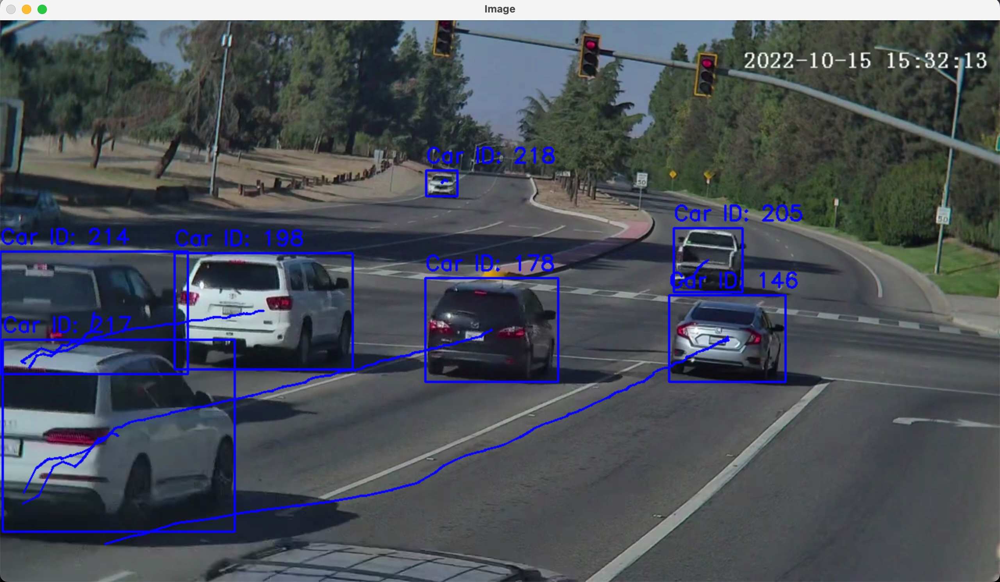
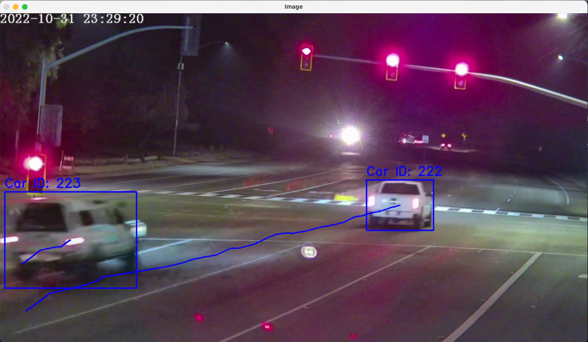

# Traffic Monitoring with YOLOv5 and SORT
CSCI 507: Computer Vision

## Overview:
This repository contains the implementation of a traffic monitoring system that uses YOLOv5 for object detection and SORT (Simple Online and Realtime Tracking) algorithm for object tracking. The system is designed to detect and track vehicles through video streams in both daylight and nighttime settings, providing real-time tracking information.

## Features
- **Real-time Vehicle Detection**: Utilizes YOLOv5 to detect vehicles with high accuracy.
- **Seamless Object Tracking**: Employs SORT algorithm to track the detected vehicles across frames.
- **Day and Night Monitoring**: Performs reliably under varying lighting conditions, proven by day and night demonstrations.
- **Unique Vehicle Identification**: Assigns unique IDs to vehicles to track their movement.
## Demonstration
See the system in action with these demonstration images:

